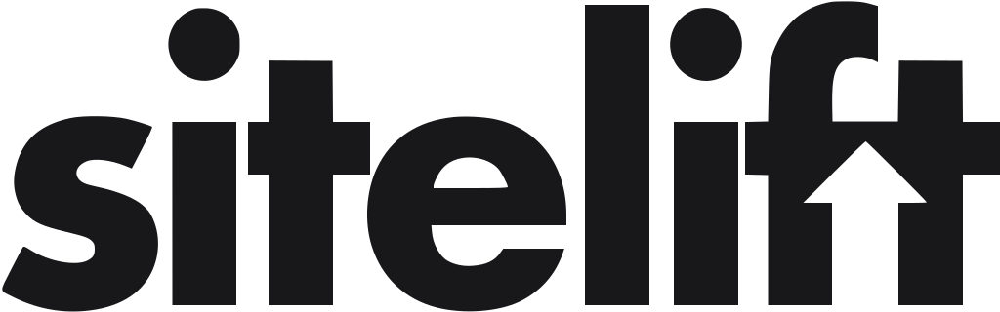

<p align="center">
  
</p>

<p align="center">
  <a href="https://github.com/sitelift/chatbots/actions/workflows/ci.yml"></a>
</p>

# SiteLift

SiteLift is an open-source chatbot platform for web agencies. You host it yourself, put your own OpenAI-compatible API key in Settings, and create a chatbot for each client website.

Each chatbot answers questions using business facts you paste into the dashboard. There is no vector database and no retrieval pipeline — the facts go straight into the system prompt. Clients get a login so they can edit their own bot. Visitors chat through a small embeddable widget.

You run everything in one Docker container with a SQLite database.

## Quick start

```bash
git clone https://github.com/sitelift/chatbots.git
cd chatbots
cp .env.example .env
# Add OPENAI_API_KEY (and OPENAI_BASE_URL if you are not using OpenAI directly)
docker compose -f docker/docker-compose.yml up -d --build
```

Open [http://localhost:3000/admin](http://localhost:3000/admin). The first account you create is the agency account.

### Local development

You need Node 22+ and pnpm.

```bash
corepack enable && pnpm install
pnpm approve-builds   # first time only, for native modules
cp .env.example .env

pnpm dev              # API on :3000
pnpm dev:dashboard    # dashboard on :5173
```

### Embedding the widget

```html
<script
  src="https://YOUR_HOST/embed.js"
  data-chatbot-id="ch_…"
  data-api-base="https://YOUR_HOST"
  async
></script>
```

Add the site's domain under the chatbot's allowed domains, or the widget will not answer.

## What is in this repo

| Path | What it is |
| --- | --- |
| `apps/server` | API and static file serving |
| `apps/dashboard` | Agency and client dashboard |
| `packages/widget` | Chat widget source (builds to `embed.js`) |
| `packages/shared` | Shared types and validation |
| `docker/` | Dockerfile and compose file |
| `docs/` | Product, architecture, and style docs |

## Docs

- [`PROGRESS.md`](PROGRESS.md) — what works today and what is next
- [`docs/PRODUCT.md`](docs/PRODUCT.md) — what we are building and why
- [`docs/ARCHITECTURE.md`](docs/ARCHITECTURE.md) — how it is put together
- [`docs/STYLE.md`](docs/STYLE.md) — design rules for the UI
- [`AGENTS.md`](AGENTS.md) — notes for AI coding assistants

## Contributing

Issues and pull requests are welcome. Before you open a PR, run:

```bash
pnpm lint && pnpm typecheck && pnpm test && pnpm build
```
